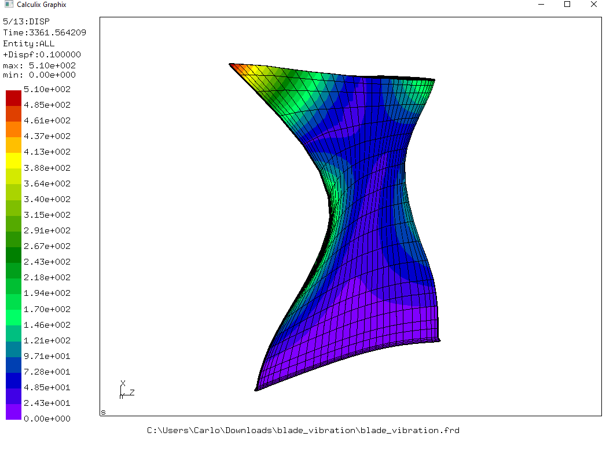

# TryScience 2020

Here couple details for the interested to open the results file at home!

+ The open source software to visualize the blade vibration modes is called CalculiX GraphiX, and the Windows version can be download from here:   http://www.bconverged.com/download.php
+ For  our TryScience talk regarding blade vibrations, the results file shown in the video can be downloaded from here: [blade_vibration.zip](https://github.com/carlomontec/carlomontec.github.com/raw/master/blade_vibration.zip)

Best Regards
Carlo Monjaraz

